# Architecture & Project Walkthrough

## Overview

This document is a step-by-step visual walkthrough of the entire project —
from Azure App Registration through OAuth 2.0 authentication to live Outlook
inbox governance via the Microsoft Graph API.

---

## Phase 1 — Azure App Registration

### Step 1.1 — Azure Portal Login

Access begins at portal.azure.com, authenticated with the Microsoft account
that owns the Outlook inbox being governed.

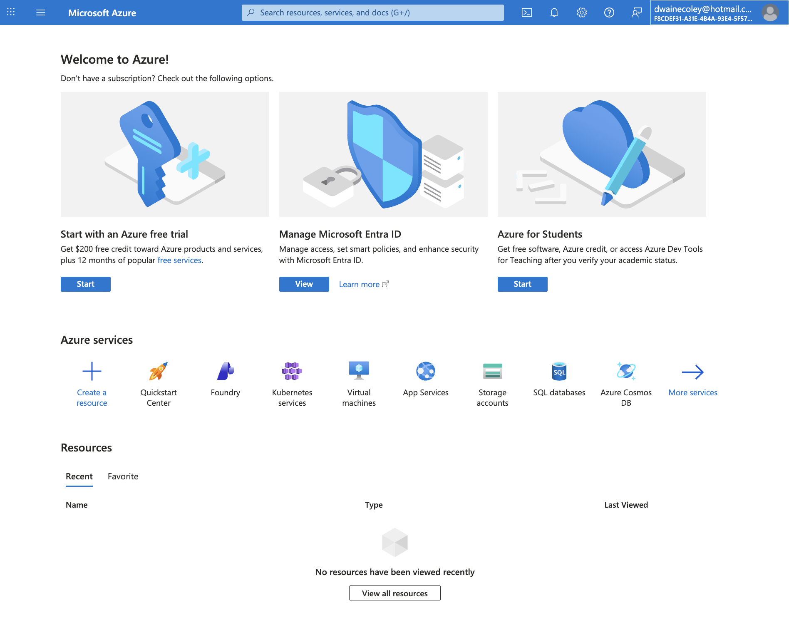

---

### Step 1.3 — Register the Application

A new App Registration is created inside Azure Active Directory (Microsoft Entra ID).
This gives the Python script its own identity with only the permissions it needs —
the least privilege principle in action.

**Settings used:**
- Name: `outlook-governance-script`
- Supported account types: Single tenant only — Default Directory
- Redirect URI: None at this stage

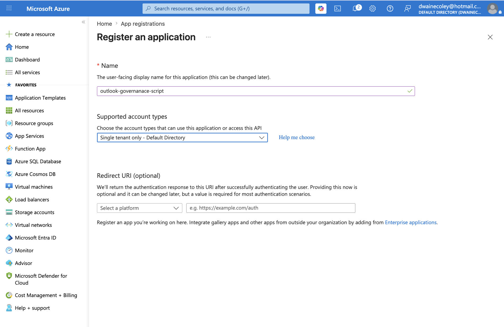

---

### Step 1.4 — App Credentials

After registration, Azure generates three critical identifiers used by the script
to authenticate against the correct tenant and application.

| Field | Purpose |
|-------|---------|
| Application (client) ID | Identifies this specific app registration |
| Directory (tenant) ID | Identifies the Azure AD tenant |
| Object ID | Internal Azure object reference |

> ⚠️ All credential values are stored in `.env` only — never committed to version control.

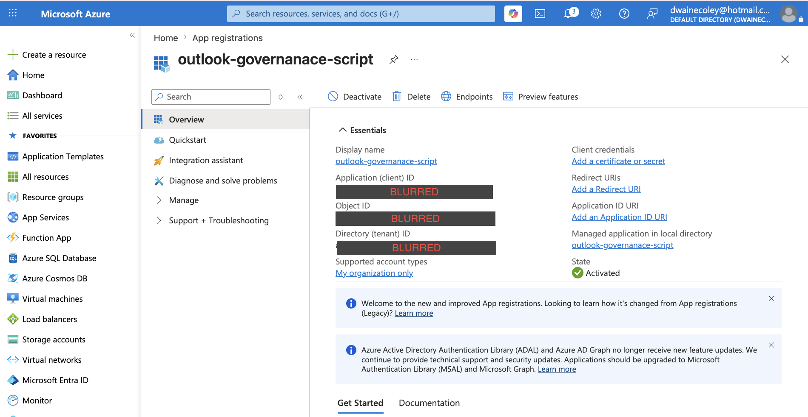

---

### Step 1.5 — Client Secret

The client secret acts as the application password. It proves to Azure AD
that the script is the legitimate registered app.

**Security practices:**
- 90-day expiry — short-lived credential rotation
- Value stored in `.env` — never logged or hardcoded
- Labeled for easy identification and future rotation

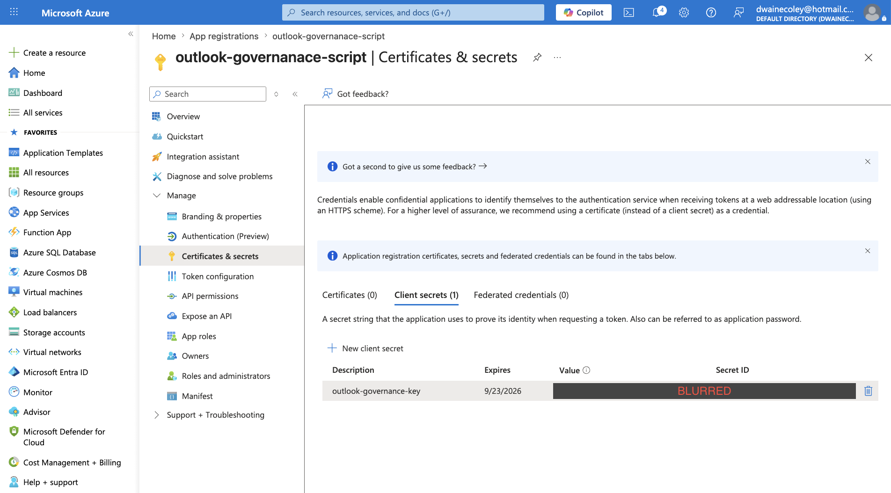

---

### Step 1.6 — API Permissions (Least Privilege)

Only the minimum permissions required are granted. No admin-level or
tenant-wide scopes are used.

| Permission | Type | Purpose |
|-----------|------|---------|
| `Mail.Read` | Delegated | Read mailbox folder structure |
| `Mail.ReadWrite` | Delegated | Create and organize folders |
| `MailboxSettings.Read` | Delegated | Read inbox rules and safe senders |
| `MailboxSettings.ReadWrite` | Delegated | Create and modify inbox rules |
| `User.Read` | Delegated | Sign in and read user profile |

> **Why Delegated?** Delegated permissions act on behalf of the signed-in user —
correct for personal mailbox access. Application permissions require tenant-admin
consent not available on personal Microsoft accounts.

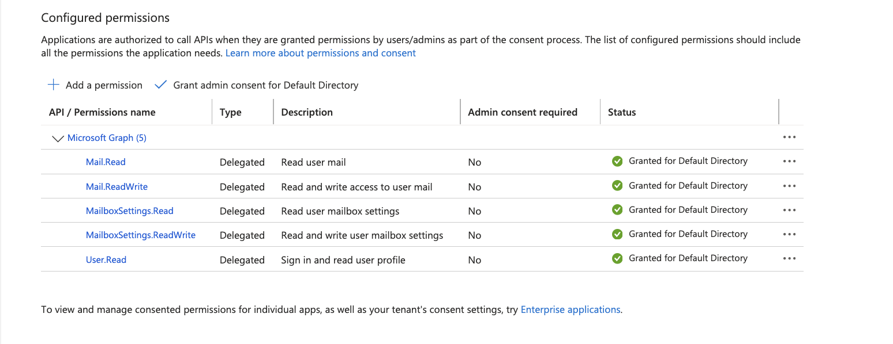

---

## Phase 2 — Local Environment Setup

### Step 2.1 — Terminal

All environment setup and script execution happens in macOS Terminal.

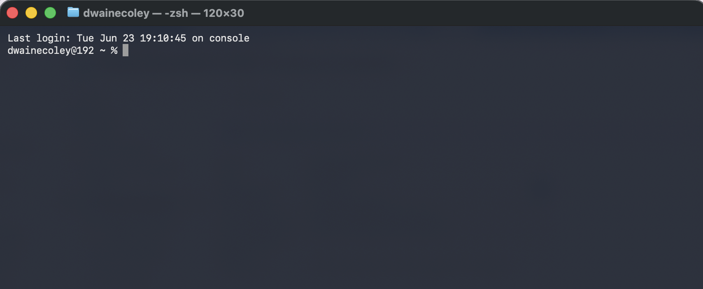

---

### Step 2.3 — Install Homebrew

Homebrew is the standard macOS package manager for developer tools.
The install manifest shows exactly which directories are created — relevant
to endpoint security and system hardening.

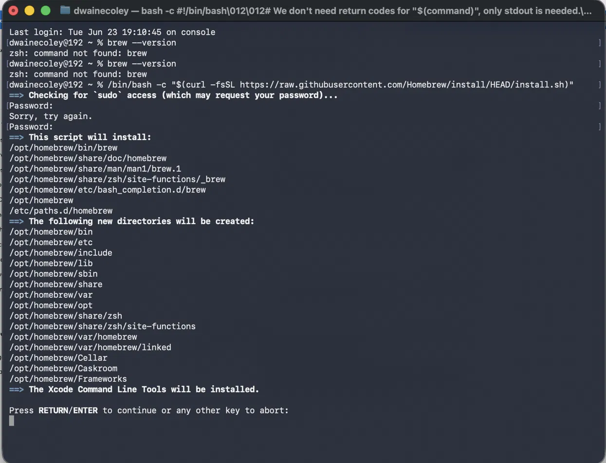

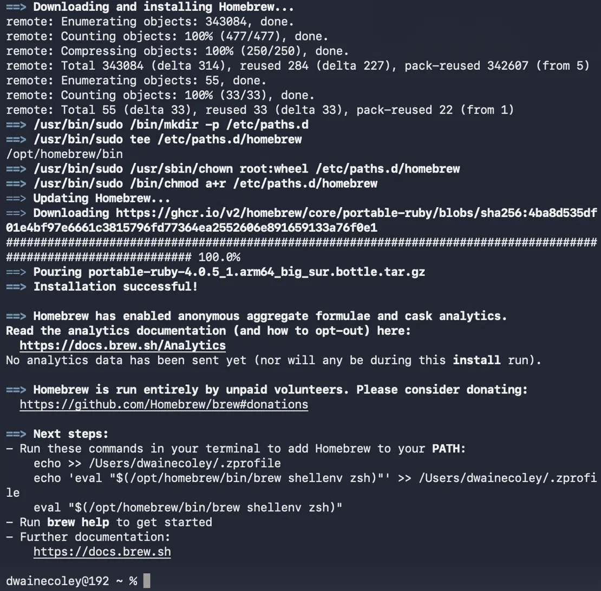

---

### Step 2.4 — Install Python

Python 3 is installed via Homebrew and verified.

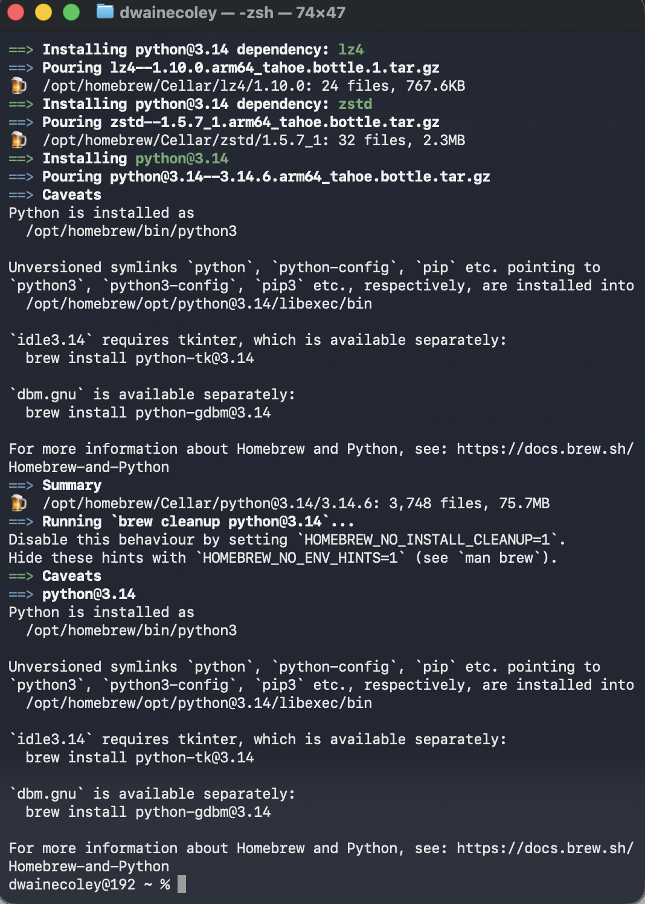

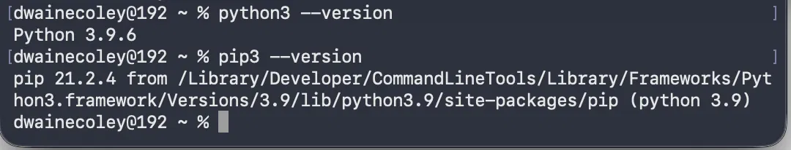

---

### Step 2.5 — Resolve PATH Conflict

macOS has two Python installations. The PATH is updated to ensure the
Homebrew version takes precedence over the system version.

**Security relevance:** PATH precedence is directly related to PATH hijacking
attacks — a technique covered in Security+ Domain 2.0.

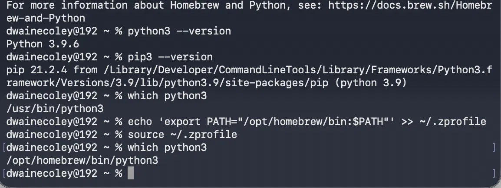

---

### Step 2.8 — Virtual Environment + Dependencies

Python's externally-managed-environment protection requires a virtual environment
for project dependencies — itself a security best practice.

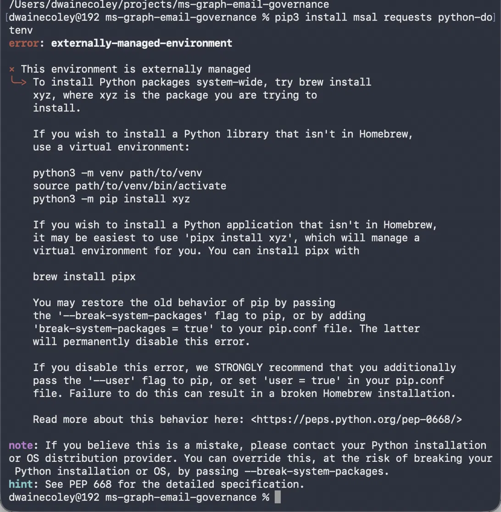

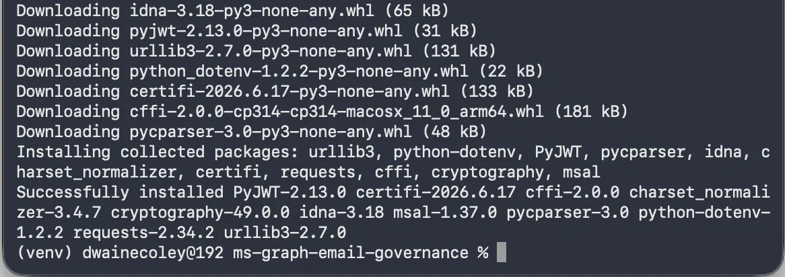

**Packages installed:**

| Package | Purpose |
|---------|---------|
| `msal` | OAuth 2.0 token acquisition |
| `requests` | HTTP calls to Graph API |
| `python-dotenv` | Loads `.env` credentials securely |
| `cryptography` | Token signing and verification |
| `PyJWT` | JSON Web Token parsing |
| `certifi` | SSL certificate verification |

---

## Phase 3 — Authentication

### Step 3.1 — First Token (Client Credentials Flow)

The first token acquisition used the client credentials flow — authenticating
as the app itself. This succeeded but was blocked by the `/me` endpoint which
requires a delegated (user-signed-in) token.

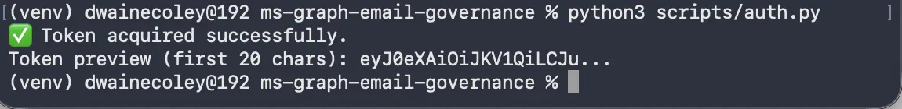

---

### Step 3.2 — Redirect URI Error

Switching to the interactive delegated flow revealed a missing redirect URI
in the Azure app registration — `AADSTS500113`.

**Security concept:** Redirect URIs are a core OAuth 2.0 security control.
They prevent token interception by ensuring tokens are only sent to
pre-registered destinations.

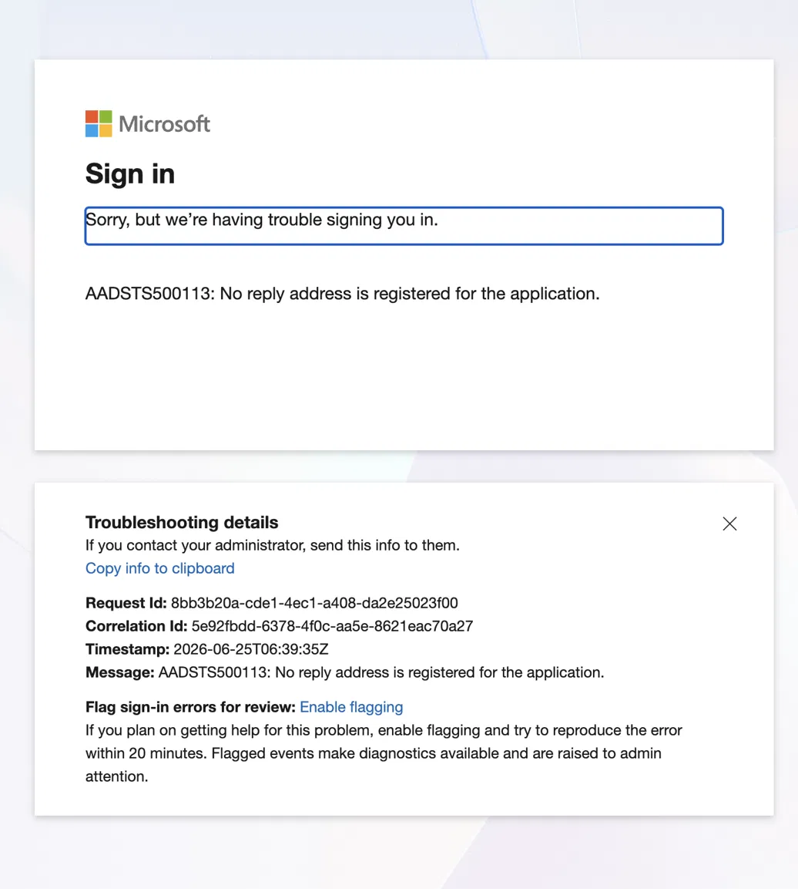

---

### Step 3.3 — Delegated Token via Device Code Flow

After resolving the app registration configuration, the Device Code Flow was
implemented — no redirect URI required. A code is printed, entered at
`microsoft.com/devicelogin`, and the delegated token is returned.

The token format changed from `eyJ0eX...` (JWT) to `EwBIBM...` (Microsoft
personal account token) — confirming the user identity is now attached.

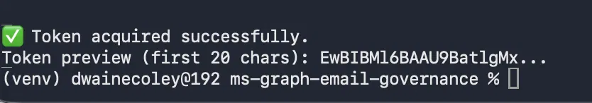

---

## Phase 4 — Inbox Governance

### Step 4.1 — Folder Audit

`audit_folders.py` retrieves the complete Outlook folder structure via
Microsoft Graph API — 41 top-level folders with full subfolder tree,
email counts, and unread counts.

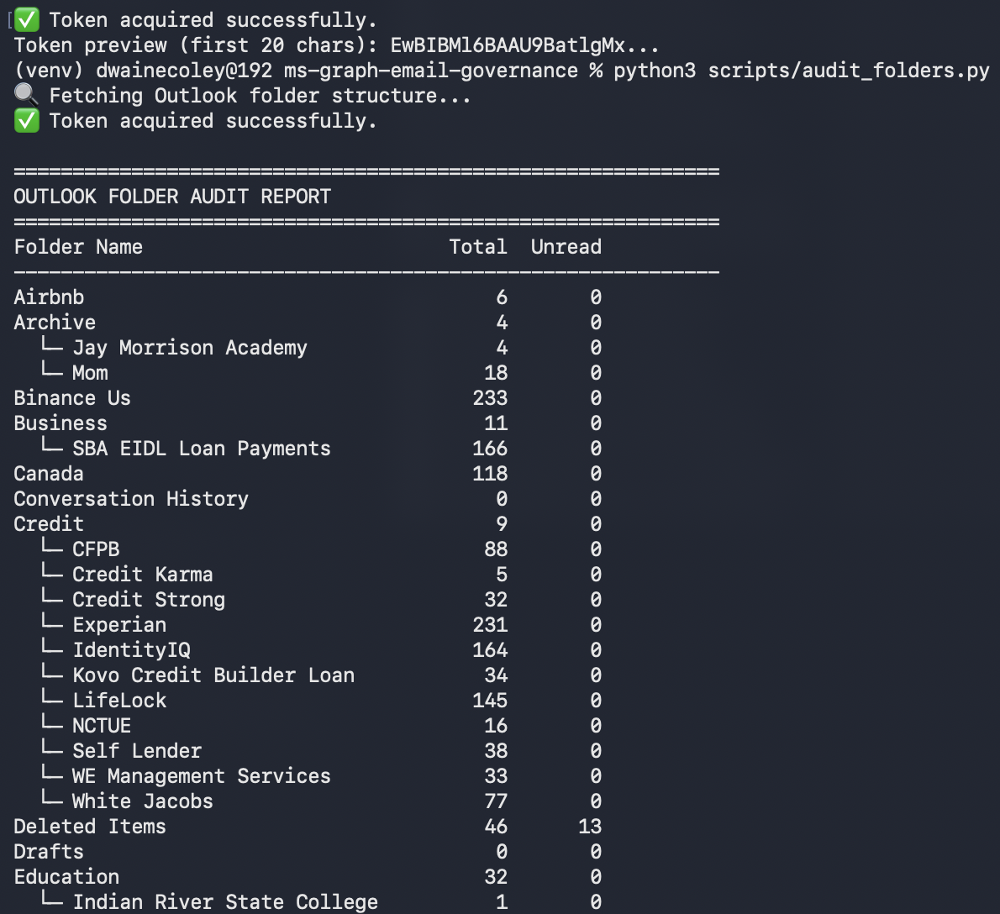

---

### Step 4.3 — Inbox Actions

`inbox_actions.py` executes a four-step automated governance workflow:

1. **Delete** — 69 emails removed from unwanted senders
2. **Create** — 2 new folders created (The Points Guy, Substack)
3. **Move** — 25 existing emails sorted into new folders
4. **Rules** — 2 inbox rules created for automatic future filtering

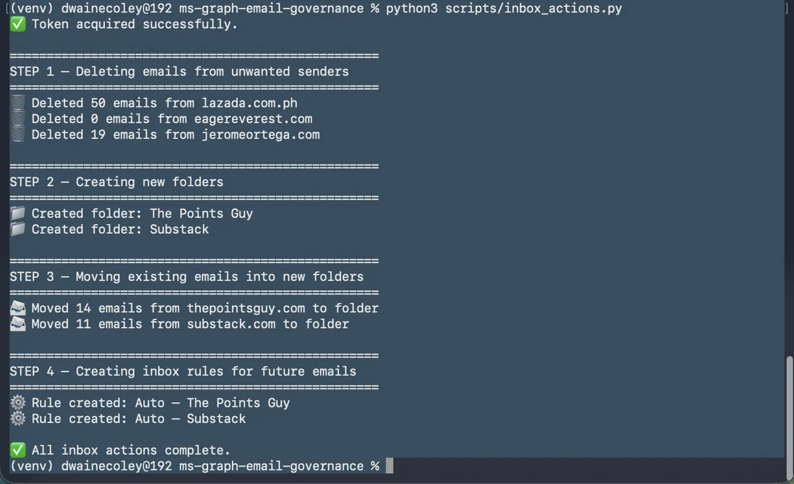

---

## Auth Flow Diagram

```
[Python Script]
      |
      | 1. Initiate device code flow
      v
[Azure AD / Microsoft Entra ID]
      |
      | 2. Return user_code + verification_uri
      v
[User enters code at microsoft.com/devicelogin]
      |
      | 3. Azure validates identity, issues delegated token
      v
[Microsoft Graph API — graph.microsoft.com/v1.0]
      |
      | 4. Execute scoped operations (read mail, manage folders, rules)
      v
[Outlook Mailbox]
```

---

## Token Security Practices

| Practice | Implementation |
|---------|---------------|
| No hardcoded credentials | Loaded from `.env` via `python-dotenv` |
| `.env` never committed | Excluded via `.gitignore` |
| Short-lived tokens | MSAL handles expiry and refresh automatically |
| Least privilege scopes | Mail and mailbox settings only |
| Token in memory only | Never written to disk or logged |
| Short-lived PAT | GitHub PAT revoked after each session |
